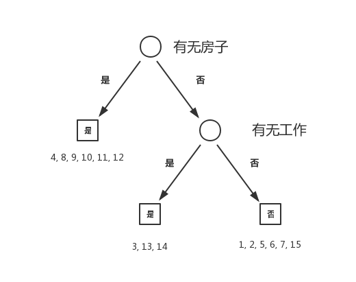

# 5.6 习题

#### 5.6.1

设 $$A_1$$ 为年龄情况， $$A_2$$ 为工作情况， $$A_3$$ 为是否有房， $$A_4$$ 为信贷情况， $$Y$$ 为类别，且初始状态时 $$D = \{1, \dots, 15\}$$ 。

$$H(D) = -\frac{9}{15}\log_2\frac{9}{15} - \frac{6}{15}\log_2\frac{6}{15} = 0.971$$ 

$$g(D, A_1) = H(D) - [\frac{5}{15}(-\frac{3}{15}\log_2\frac{3}{5} - \frac{2}{5}\log_2\frac{2}{5}) + \frac{5}{15}(-\frac{3}{15}\log_2\frac{3}{5} - \frac{2}{5}\log_2\frac{2}{5}) + \frac{5}{15}(-\frac{4}{15}\log_2\frac{4}{5} - \frac{1}{5}\log_2\frac{1}{5} )] = 0.971 - 0.888 = 0.083$$ 

| $$g(D, A)$$  | $$H(D, A)$$  | $$g_R(D, A)$$  |
| :--- | :--- | :--- |
| $$g(D, A_1) = 0.083$$  | $$H(D, A_1) = 0.888$$  | $$g_R(D, A_1) = 0.093$$  |
| $$g(D, A_2) = 0.324$$  | $$H(D, A_2) = 0.647$$  | $$g_R(D, A_2) = 0.501$$  |
| $$g(D, A_3) = 0.42$$  | $$H(D, A_3) = 0.55$$  | $$g_R(D, A_3) = 0.764$$  |
| $$g(D, A_4) = 0.363$$  | $$H(D, A_4) = 0.608$$  | $$g_R(D, A_4) = 0.597$$  |

选择 $$A_3$$ 作为特征，将 $$D$$ 分为两个子集 $$D_1, D_2$$ ，其中 $$D_1 =\{4, 8, 9, 10, 11, 12\}, D_2 = \{1, 2, 3, 5, 6, 7, 13, 14, 15\}$$ 。因为 $$D_1$$ 中的实例均为同一类，不需要继续分割，现在考虑 $$D_2$$ 。

$$H(D_2) = -\frac{3}{9}\log_2\frac{3}{9} - \frac{6}{9}\log_2\frac{6}{9} = 0.918$$ 

| $$g(D_2, A)$$  | $$H(D_2, A)$$  | $$g_R(D_2, A)$$  |
| :--- | :--- | :--- |
| $$g(D_2, A_1) = 0.251$$  | $$H(D_2, A_1) = 0.667$$  | $$g_R(D_2, A_1) = 0.376$$  |
| $$g(D_2, A_2) = 0.918$$  | $$H(D_2, A_2) = 0$$  | $$g_R(D_2, A_2) = \infty$$  |
| $$g(D_2, A_4) = 0.474$$  | $$H(D_2, A_4) = 0.444$$  | $$g_R(D_2, A_4) = 1.067$$  |

选择 $$A_2$$ 作为特征，将 $$D_2$$ 分为两个子集 $$D_3, D_4$$ ，其中 $$D_3= \{3, 13, 14\}, D_4 = \{1, 2, 5, 6, 7, 15\}$$ 。

